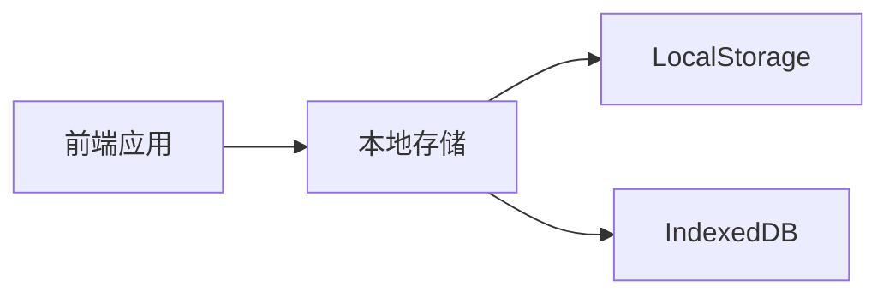
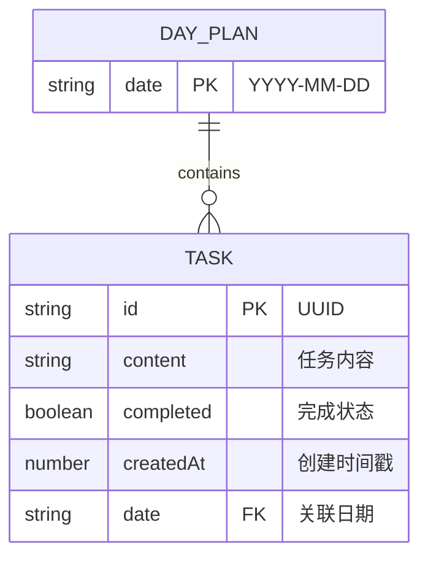

## 1. 架构设计


## 2. 技术选型
- **前端框架**：React@18 + TypeScript
- **构建工具**：Vite@6
- **样式框架**：TailwindCSS@3
- **图标库**：Lucide React
- **路由**：React Router DOM
- **状态管理**：React Context + useState
- **数据持久化**：LocalStorage（简单数据）+ IndexedDB（复杂数据）

## 3. 路由定义
| 路由 | 用途 |
|------|------|
| / | 首页（日历视图） |
| /daily/:date | 每日规划页 |
| /weekly | 周计划页 |

## 4. API定义（无后端，前端本地操作）

### 4.1 数据模型类型定义
```typescript
interface Task {
  id: string;
  content: string;
  completed: boolean;
  createdAt: number;
}

interface DayPlan {
  date: string; // YYYY-MM-DD 格式
  tasks: Task[];
}

interface WeeklyPlan {
  weekStart: string; // 周一日期
  weekEnd: string;   // 周日日期
  dayPlans: DayPlan[];
}

interface Subject {
  id: string;
  name: string;
  color: string;
}

interface TaskType {
  id: string;
  name: string;
  icon: string;
}
```

### 4.2 存储操作接口
```typescript
interface StorageService {
  getDayPlan(date: string): Promise<DayPlan | null>;
  saveDayPlan(plan: DayPlan): Promise<void>;
  deleteDayPlan(date: string): Promise<void>;
  getWeeklyPlan(weekStart: string): Promise<WeeklyPlan | null>;
  saveWeeklyPlan(plan: WeeklyPlan): Promise<void>;
  getAllDayPlans(): Promise<DayPlan[]>;
}
```

## 5. 服务器架构（无后端）
本应用为纯前端应用，无需服务器。数据存储在浏览器本地。

## 6. 数据模型

### 6.1 数据模型定义


### 6.2 数据初始化
```typescript
const defaultSubjects: Subject[] = [
  { id: 'math', name: '数学', color: '#4A90D9' },
  { id: 'english', name: '英语', color: '#67C23A' },
  { id: 'physics', name: '物理', color: '#E6A23C' },
];

const defaultTaskTypes: TaskType[] = [
  { id: 'exam', name: '卷子', icon: 'file-text' },
  { id: 'summary', name: '总结', icon: 'clipboard-list' },
];
```

## 7. 项目结构
```
src/
├── components/
│   ├── Calendar/
│   │   ├── Calendar.tsx
│   │   └── CalendarDay.tsx
│   ├── TaskList/
│   │   ├── TaskItem.tsx
│   │   └── TaskList.tsx
│   ├── Header.tsx
│   ├── AddTaskButton.tsx
│   └── TaskModal.tsx
├── pages/
│   ├── HomePage.tsx
│   ├── DailyPlanPage.tsx
│   └── WeeklyPlanPage.tsx
├── services/
│   └── storage.ts
├── context/
│   └── PlanContext.tsx
├── types/
│   └── index.ts
├── utils/
│   ├── date.ts
│   └── planGenerator.ts
├── App.tsx
├── main.tsx
└── index.css
```